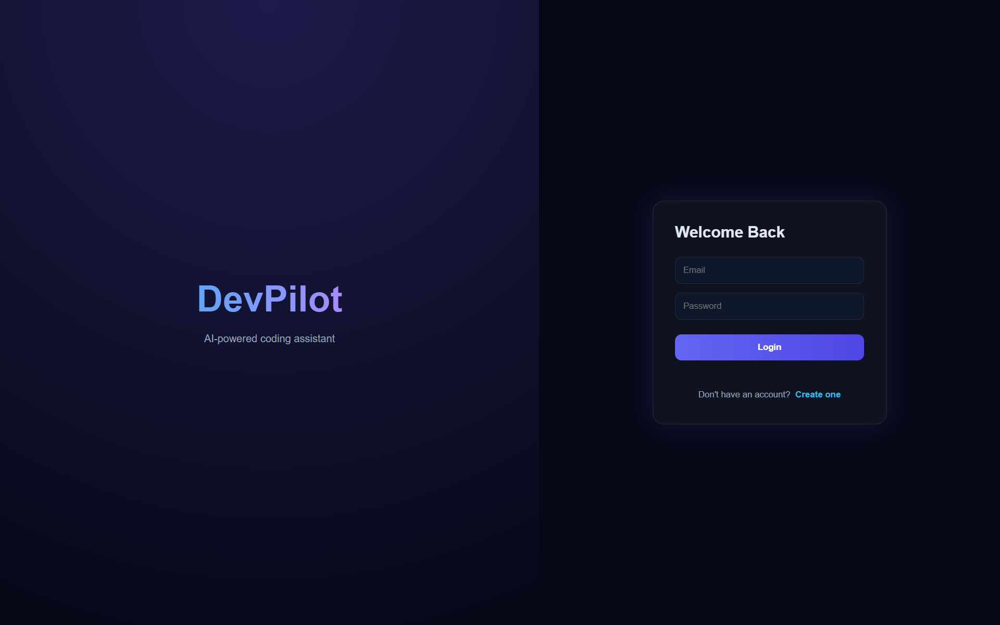
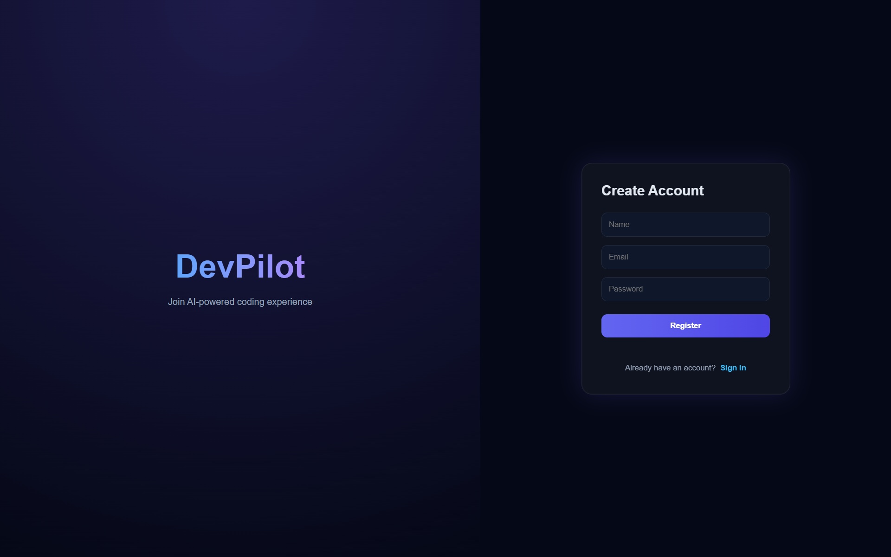
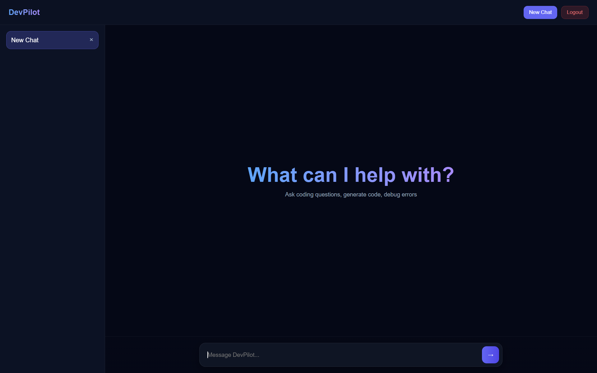

# DevPilot

DevPilot is a full-stack AI-powered coding assistant built with the MERN stack. It provides secure authentication, persistent chat history, markdown rendering, syntax-highlighted code responses, and AI-assisted conversations. The application is designed with a modern architecture and production-oriented practices.

## Features

* User authentication with JWT
* Secure password hashing using bcrypt
* Protected API routes
* Persistent multi-chat conversations
* Chat history stored in MongoDB
* Create and delete conversations
* AI-powered responses using Google Gemini
* Markdown rendering support
* Syntax highlighting for code blocks
* Responsive and modern interface
* RESTful backend architecture
* Modular and scalable folder structure

## Overview





## Tech Stack

### Frontend

* React
* Vite
* React Router DOM
* Axios
* React Markdown
* React Syntax Highlighter

### Backend

* Node.js
* Express.js
* MongoDB
* Mongoose
* JWT Authentication
* bcryptjs
* CORS
* dotenv

### AI Integration

* Google Gemini API

## Project Structure

```text
devpilot
│
├── backend
│   ├── config
│   ├── controllers
│   ├── middleware
│   ├── models
│   ├── routes
│   ├── .env.example
│   ├── package.json
│   ├── package-lock.json
│   └── server.js
│
├── frontend
│   ├── src
│   │   ├── api
│   │   ├── components
│   │   ├── pages
│   │   ├── styles
│   │   ├── App.jsx
│   │   └── main.jsx
│   │
│   ├── package.json
│   ├── package-lock.json
│   ├── vite.config.js
│   ├── eslint.config.js
│   └── .gitignore
│
├── images/
├── .gitignore
└── README.md
```

## Installation

### Clone the Repository

```bash
git clone https://github.com/samoff04/DevPilot.git
cd DevPilot
```

## Backend Setup

```bash
cd backend
npm install
```

Create a `.env` file inside the backend directory:

```env
MONGO_URI=your_mongodb_connection_string
JWT_SECRET=your_secret_key
GEMINI_API_KEY=your_gemini_api_key
```

Start the backend server:

```bash
npm run dev
```

## Frontend Setup

```bash
cd frontend
npm install
npm run dev
```

The frontend runs on:

```text
http://localhost:5173
```

The backend runs on:

```text
http://localhost:5000
```

## API Endpoints

### Authentication

| Method | Endpoint           |
| ------ | ------------------ |
| POST   | /api/auth/register |
| POST   | /api/auth/login    |

### Chat

| Method | Endpoint      |
| ------ | ------------- |
| GET    | /api/chat     |
| POST   | /api/chat     |
| PUT    | /api/chat/:id |
| DELETE | /api/chat/:id |
| POST   | /api/chat/ask |

## Future Enhancements

* Chat renaming
* Profile management
* OpenRouter fallback support
* Conversation search
* Theme customization

## Security

* Passwords are hashed using bcrypt.
* JWT-based authentication protects routes.
* Sensitive credentials are stored in environment variables.
* `.env` files are excluded from version control.

## License

This project is licensed under the MIT License.

## Author

Samarth Varshney
